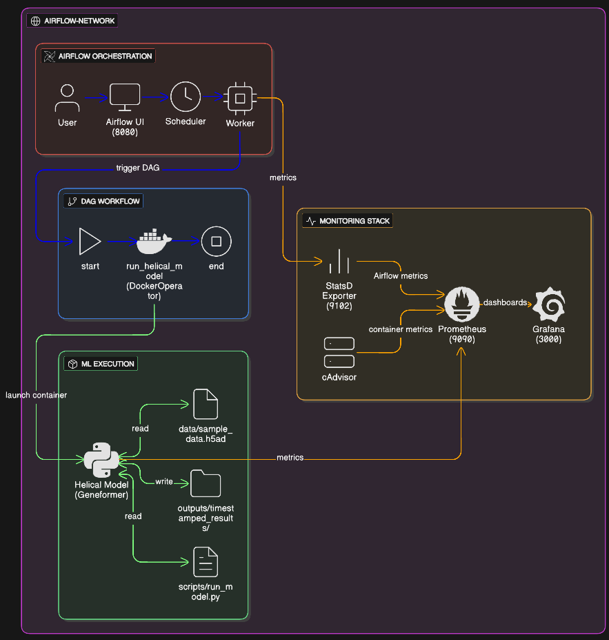

# Helical Geneformer Workflow — Containerized ML Pipeline Orchestrated with Airflow

This repository implements a **containerized machine learning workflow** for running and fine-tuning the **Helical Geneformer** model using **Docker** and **Apache Airflow**, complete with **metrics**, **monitoring**, and a clean orchestration design.

This project was built as part of the *Cloud & Container Engineering* technical assignment for Helical and demonstrates:

* Containerization of ML workloads
* Workflow orchestration via Airflow
* Observability with Prometheus + Grafana

---

## Architecture Overview

The workflow is composed of two major components:

1. **Helical Model Container** — runs the actual fine-tuning job
2. **Airflow Cluster** — orchestrates, schedules, and monitors the workflow

It is supported by an observability stack (Prometheus, StatsD exporter, cAdvisor, Grafana).

### High-Level Architecture Diagram



---

## End-to-End Workflow Summary

1. **Airflow DAG** triggers a run → uses `DockerOperator`
2. DAG launches the **`helical-model`** container
3. Container mounts:

   * `/app/data` → local input dataset (`.h5ad`)
   * `/app/scripts` → fine-tuning script
   * `/app/outputs` → timestamped results
4. Model script:

   * Loads & preprocesses data
   * Fine-tunes Geneformer
   * Runs inference
   * Generates embeddings & visualizations
   * Exports Prometheus metrics
5. Outputs are stored locally:

   ```
   helical-model/outputs/<dataset_timestamp>/
   ```
6. Prometheus scrapes Airflow + model metrics
7. Grafana visualizes:

   * DAG run times
   * Task success/failure counts
   * Container CPU/memory usage
   * Model execution metrics

---

## Repository Structure

```
helical-assignment/
├── Architecture.png                 # Architecture diagram
├── README.md                        # Main documentation (this file)
│
├── helical-model/                   # Model container
│   ├── Dockerfile
│   ├── docker-compose.yaml
│   ├── requirements-model.txt
│   ├── data/                        # Input .h5ad dataset
│   ├── outputs/                     # Timestamped model outputs
│   └── scripts/                     # run_model.py
│
└── airflow/                         # Airflow cluster + monitoring
    ├── docker-compose.yaml
    ├── dags/helical_dag.py
    ├── monitoring/
    │   ├── prometheus.yml
    │   ├── statsd_mapping.yml
    │   └── grafana/
    └── logs/                        # Generated at runtime
```

---

## Prerequisites

- Docker & Docker Compose installed
- At least 8GB RAM allocated to Docker

---

## Configuration

Before starting, you need to configure the local paths:

### 1. Set up environment variables

Copy the example environment file and update paths:
```bash
cd airflow
cp .env.example .env
```

Edit `.env` and update the paths to match your local directory structure:
```bash
# On Linux/Mac:
HELICAL_DATA_PATH=/home/youruser/helical-assignment/helical-model/data
HELICAL_OUTPUT_PATH=/home/youruser/helical-assignment/helical-model/outputs
HELICAL_SCRIPTS_PATH=/home/youruser/helical-assignment/helical-model/scripts

# On Windows (using absolute paths):
HELICAL_DATA_PATH=C:/Users/YourUsername/helical-assignment/helical-model/data
HELICAL_OUTPUT_PATH=C:/Users/YourUsername/helical-assignment/helical-model/outputs
HELICAL_SCRIPTS_PATH=C:/Users/YourUsername/helical-assignment/helical-model/scripts
```

### 2. Create Docker network
```bash
docker network create airflow-network
```

---

## Setup Instructions

### 1️. Build the Helical Model Container

```bash
cd helical-model
docker build -t helical-model:latest .
```

### 2️. (Optional) Run Model Container Manually

```bash
docker run -it --rm \
  -v "$(pwd)/data:/app/data" \
  -v "$(pwd)/outputs:/app/outputs" \
  -v "$(pwd)/scripts:/app/scripts" \
  helical-model
```

Or can be done using docker-compose as well:

```bash
docker-compose up -d
```

### 3️. Start Airflow + Monitoring Stack

From inside `airflow/`:

```bash
docker network create airflow-network
docker-compose up airflow-init
docker-compose up -d
```

Airflow UI → **[http://localhost:8080](http://localhost:8080)**
Prometheus → **[http://localhost:9090](http://localhost:9090)**
Grafana → **[http://localhost:3000](http://localhost:3000)** (admin/admin)
cAdvisor → **[http://localhost:8081](http://localhost:8081)**

### 4. Trigger the Workflow

1. Open Airflow UI
2. Enable `helical_fine_tune_dag`
3. Trigger manually
4. Track logs in Airflow

---

## Outputs Generated per Run

Each execution produces a folder:

```
helical-model/outputs/<dataset_timestamp>/
├── raw_logits.csv
├── predicted_celltypes.csv
└── fine_tuned_embeddings.npy
```

---

## Monitoring & Observability

### Prometheus Metrics From Model

* `helical_model_runs_total`
* `helical_model_status`
* `helical_model_duration_seconds`
* `helical_training_duration_seconds`
* `helical_samples_processed_total`
* `helical_genes_processed_total`

### Airflow Metrics (via StatsD Exporter)

* DAG run duration
* Task success/failure counts
* Scheduler heartbeat

### Container Metrics (via cAdvisor)

* CPU usage
* Memory consumption
* Network I/O
* Filesystem usage

### Grafana Dashboard

A Grafana dashboard is automatically provisioned showing:

* Airflow DAG timings
* Task success/failure
* Model run duration
* Container usage (CPU/Memory)

---

## Key Features Demonstrated

* Fully containerized ML workflow
* Reproducible orchestration with Airflow
* DockerOperator-based ephemeral model containers
* Local volume mounts for data & scripts
* Timestamped output runs
* Integrated Prometheus + Grafana monitoring
* cAdvisor container metrics

---

## Author

**Aditya Joshi**


